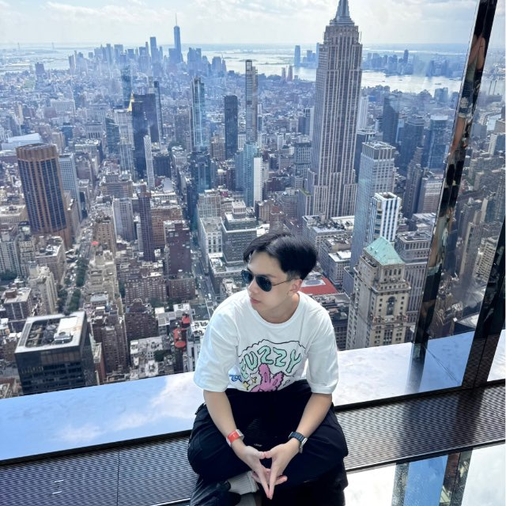

We are a team based in the [School of Computing, National University of Singapore](http://www.comp.nus.edu.sg).

You can reach us at the email `cs2103t_w14_4@comp.nus.edu.sg`

## Project team

### Tze Foong

[[github](https://github.com/6felix9)]

* Role: Documentation

---

### Keiko

[[github](https://github.com/keikofloren)]

* Role: Team Lead

---

### Alexander

[[github](https://github.com/alexgeraldhandoko)]

* Role: Testing

### Vincent Gavriel Julijanto

[[github](http://github.com/VincentJulijanto)]

* Role: Code Quality
* Responsibilities: Looks after code quality, ensure adherence to coding standards.

### Kacey

[[github](https://github.com/kacey-i-y)]

* Role: Deliverables and Deadlines
