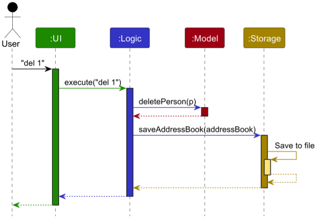
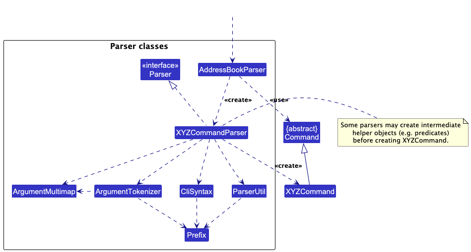
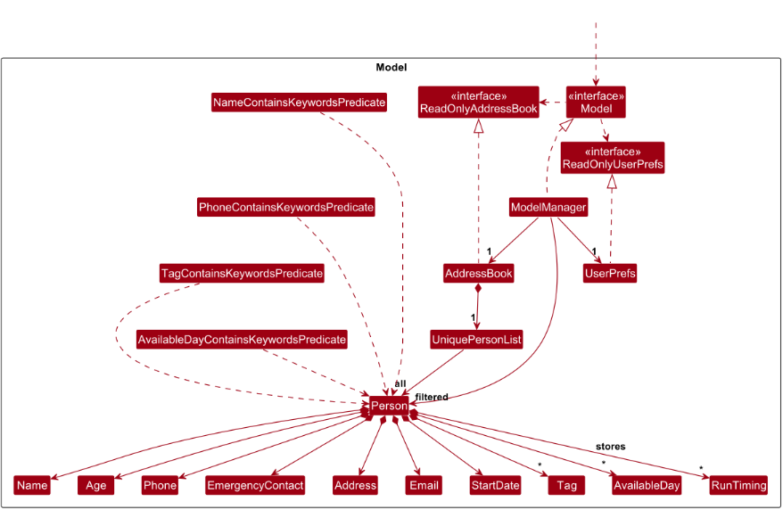

* Table of Contents
{:toc}

## **Acknowledgements**

* {list here sources of all reused/adapted ideas, code, documentation, and third-party libraries -- include links to the original source as well}

--------------------------------------------------------------------------------------------------------------------

## **Setting up, getting started**

Refer to the guide [_Setting up and getting started_](SettingUp.md).

--------------------------------------------------------------------------------------------------------------------

## **Design**

<div markdown="span" class="alert alert-primary">

:bulb: **Tip:** The `.puml` files used to create diagrams are in this document `docs/diagrams` folder. Refer to the [_PlantUML Tutorial_ at se-edu/guides](https://se-education.org/guides/tutorials/plantUml.html) to learn how to create and edit diagrams.
</div>

### Architecture


The ***Architecture Diagram*** given above explains the high-level design of the App.

Given below is a quick overview of main components and how they interact with each other.

**Main components of the architecture**

**`Main`** (consisting of classes [`Main`](https://github.com/se-edu/addressbook-level3/tree/master/src/main/java/seedu/address/Main.java) and [`MainApp`](https://github.com/se-edu/addressbook-level3/tree/master/src/main/java/seedu/address/MainApp.java)) is in charge of the app launch and shut down.
* At app launch, it initializes the other components in the correct sequence, and connects them up with each other.
* At shut down, it shuts down the other components and invokes cleanup methods where necessary.

The bulk of the app's work is done by the following four components:

* [**`UI`**](#ui-component): The UI of the App.
* [**`Logic`**](#logic-component): The command executor.
* [**`Model`**](#model-component): Holds the data of the App in memory.
* [**`Storage`**](#storage-component): Reads data from, and writes data to, the hard disk.

[**`Commons`**](#common-classes) represents a collection of classes used by multiple other components.

**How the architecture components interact with each other**

The *Sequence Diagram* below shows how the components interact with each other for the scenario where the user issues the command `delete 1`.



Each of the four main components (also shown in the diagram above),

* defines its *API* in an `interface` with the same name as the Component.
* implements its functionality using a concrete `{Component Name}Manager` class (which follows the corresponding API `interface` mentioned in the previous point.

For example, the `Logic` component defines its API in the `Logic.java` interface and implements its functionality using the `LogicManager.java` class which follows the `Logic` interface. Other components interact with a given component through its interface rather than the concrete class (reason: to prevent outside component's being coupled to the implementation of a component), as illustrated in the (partial) class diagram below.


The sections below give more details of each component.

### UI component

The **API** of this component is specified in [`Ui.java`](https://github.com/se-edu/addressbook-level3/tree/master/src/main/java/seedu/address/ui/Ui.java)


The UI consists of a `MainWindow` that is made up of parts e.g.`CommandBox`, `ResultDisplay`, `PersonListPanel`, `StatusBarFooter` etc. All these, including the `MainWindow`, inherit from the abstract `UiPart` class which captures the commonalities between classes that represent parts of the visible GUI.

The `UI` component uses the JavaFx UI framework. The layout of these UI parts are defined in matching `.fxml` files that are in the `src/main/resources/view` folder. For example, the layout of the [`MainWindow`](https://github.com/se-edu/addressbook-level3/tree/master/src/main/java/seedu/address/ui/MainWindow.java) is specified in [`MainWindow.fxml`](https://github.com/se-edu/addressbook-level3/tree/master/src/main/resources/view/MainWindow.fxml)

The `UI` component,

* executes user commands using the `Logic` component.
* listens for changes to `Model` data so that the UI can be updated with the modified data.
* keeps a reference to the `Logic` component, because the `UI` relies on the `Logic` to execute commands.
* depends on some classes in the `Model` component, as it displays `Person` object residing in the `Model`.

### Logic component

**API** : [`Logic.java`](https://github.com/se-edu/addressbook-level3/tree/master/src/main/java/seedu/address/logic/Logic.java)

Here's a (partial) class diagram of the `Logic` component:


The sequence diagram below illustrates the interactions within the `Logic` component, taking `execute("del 1")` API call as an example.


<div markdown="span" class="alert alert-info">:information_source: **Note:** The lifeline for `DeleteAthleteCommandParser` should end at the destroy marker (X) but due to a limitation of PlantUML, the lifeline continues till the end of diagram.
</div>

How the `Logic` component works:

1. When `Logic` is called upon to execute a command, it is passed to an `AddressBookParser` object which in turn creates a parser that matches the command (e.g., `DeleteCommandParser`) and uses it to parse the command.
1. This results in a `Command` object (more precisely, an object of one of its subclasses e.g., `DeleteAthleteCommand`) which is executed by the `LogicManager`.
1. The command can communicate with the `Model` when it is executed (e.g. to delete a person).<br>
   Note that although this is shown as a single step in the diagram above (for simplicity), in the code it can take several interactions (between the command object and the `Model`) to achieve.
1. The result of the command execution is encapsulated as a `CommandResult` object which is returned back from `Logic`.

Here are the other classes in `Logic` (omitted from the class diagram above) that are used for parsing a user command:



How the parsing works:
* When called upon to parse a user command, the `AddressBookParser` class creates an `XYZCommandParser` (`XYZ` is a placeholder for the specific command name e.g., `AddAthleteCommandParser`) which uses the other classes shown above to parse the user command and create a `XYZCommand` object (e.g., `AddCommand`) which the `AddressBookParser` returns back as a `Command` object.
* All `XYZCommandParser` classes (e.g., `AddAthleteCommandParser`, `DeleteAthleteCommandParser`, ...) inherit from the `Parser` interface so that they can be treated similarly where possible e.g, during testing.

### Model component
**API** : [`Model.java`](https://github.com/se-edu/addressbook-level3/tree/master/src/main/java/seedu/address/model/Model.java)




The `Model` component,

* stores the address book data i.e., all `Person` objects (which are contained in a `UniquePersonList` object).
* stores the currently 'selected' `Person` objects (e.g., results of a search query) as a separate _filtered_ list which is exposed to outsiders as an unmodifiable `ObservableList<Person>` that can be 'observed' e.g. the UI can be bound to this list so that the UI automatically updates when the data in the list change.
* stores a `UserPref` object that represents the user’s preferences. This is exposed to the outside as a `ReadOnlyUserPref` objects.
* does not depend on any of the other three components (as the `Model` represents data entities of the domain, they should make sense on their own without depending on other components)

### Storage component

**API** : [`Storage.java`](https://github.com/se-edu/addressbook-level3/tree/master/src/main/java/seedu/address/storage/Storage.java)


The `Storage` component,
* can save both address book data and user preference data in JSON format, and read them back into corresponding objects.
* inherits from both `AddressBookStorage` and `UserPrefStorage`, which means it can be treated as either one (if only the functionality of only one is needed).
* depends on some classes in the `Model` component (because the `Storage` component's job is to save/retrieve objects that belong to the `Model`)

### Common classes

Classes used by multiple components are in the `seedu.address.commons` package.

--------------------------------------------------------------------------------------------------------------------

## **Implementation**

This section describes some noteworthy details on how certain features are implemented.

### \[Proposed\] Data archiving

_{Explain here how the data archiving feature will be implemented}_


--------------------------------------------------------------------------------------------------------------------

## **Documentation, logging, testing, configuration, dev-ops**

* [Documentation guide](Documentation.md)
* [Testing guide](Testing.md)
* [Logging guide](Logging.md)
* [Configuration guide](Configuration.md)
* [DevOps guide](DevOps.md)

--------------------------------------------------------------------------------------------------------------------

## **Appendix: Requirements**

### Product scope

**Target user profile**:

Running coaches

Running coaches and track instructors who manage multiple athletes, often in school teams, clubs, academies, or private coaching, similar to how people use Strava to log and review training progress. They care about consistent tracking, quick comparisons over time, and simple ways to spot improvement.

They typically:

- Manage a significant number of athletes and contacts simultaneously
- Require fast access to athlete records and performance history
- Prefer desktop applications over mobile-first interfaces
- Type quickly and prefer keyboard-based input over mouse-heavy interactions
- Are reasonably comfortable using CLI-style workflows
- Value efficiency, minimal friction, and clear text-based summaries

Their primary needs include:

- Consistent logging of timings and results
- Quick comparisons between athletes
- Simple and fast data entry during or after training sessions
- Clean overview of their entire squad

They care about speed, clarity, and reliability more than visual aesthetics.

**Value proposition**:

Pacebook builds on AB3’s structured contact management system to help running coaches
better organise athlete information in a way that suits their unique workflow.
By consolidating decentralised athlete information into a single platform,
Pacebook empowers coaches to make more informed decisions, enhances training effectiveness,
and reduces the administrative burden. This streamlined approach allows coaches
to focus more on fostering athlete development
rather than dealing with time-consuming administrative tasks.

### User stories
Priorities: High (must have) - `* * *`, Medium (nice to have) - `* *`, Low (unlikely to have) - `*`

| Priority | As a                                 | I want to                                    | So that I can                                                             |
|----------|--------------------------------------|----------------------------------------------|---------------------------------------------------------------------------|
| `* * *`  | running coach                        | add athlete profiles                         | keep track of my students’ personal and performance information           |
| `* * *`  | running coach                        | view an athlete’s profile                    | quickly recall their performance details during training sessions         |
| `* * *`  | running coach                        | view a list of all my athletes               | get an overview of my squad                                               |
| `* * *`  | running coach                        | log running timings for an athlete           | track their performance over time                                         |
| `* *`    | running coach                        | update athlete profile details               | ensure their information stays accurate over time                         |
| `* *`    | running coach                        | keep a required emergency contact for each athlete | access trusted emergency details quickly during training or competitions |
| `* *`    | running coach                        | delete athlete profiles                      | remove athletes who are no longer under my coaching                       |
| `* *`    | running coach                        | search athletes using keywords or tags       | quickly locate specific students                                          |
| `* *`    | running coach                        | view athletes' personal bests                | quickly assess their current performance level                            |
| `* *`    | running coach                        | see when an athlete achieves a personal best | recognise improvement and motivate them                                   |
| `* *`    | running coach                        | sort athletes by personal best               | rank athletes based on their performance for analysis                     |
| `* *`    | running coach                        | find athletes by name or phone number        | locate specific athletes based on identifiable information                |
| `* *`    | running coach                        | find athletes by tags or availability        | plan and assign training schedules based on athlete type and availability |
| `*`      | running coach onboarding a new squad | import athlete profiles from a CSV file      | avoid adding them one by one                                              |
| `*`      | running coach                        | export athlete profiles to a CSV file        | back up data or use it in other systems                                   |

### Use cases

**UC1 - Add Athlete Profile**

System: Pacebook <br>
Use case: UC1 - Add Athlete Profile <br>
Actor: Coach

MSS:

1. Coach inputs details of athlete to be added: `add n/John Tan a/17 p/91234567 e/johntan@example.com ad/NUS Hall d/02/10/2026 ec/Father 92345678`
2. Pacebook validates all compulsory fields (name, age, phone, email, address, emergency contact, start date), checks that the phone number is unique, and rejects the command if the emergency contact does not follow the required `Relationship Phone` format.
3. Pacebook saves the athlete profile to the data file.
4. Pacebook displays success message with added athlete details in the message box: Added athlete: John Tan (Age: 17, Phone: 91234567, Email: johntan@example.com, Address: NUS Hall, Emergency Contact: Father 92345678, Start: 02/10/2026)
5. Athlete details are now visible in the main window.
   Use case ends.

Extensions:

- **1a.** Pacebook detects invalid athlete details.
    - **1a1.** Pacebook displays an error message indicating the validation error(s).
    - **1a2.** Coach enters new data.
    - Steps 1a1-1a2 are repeated until the data entered are correct.
    - Use case resumes from step 2.

- **1b.** Pacebook detects that the phone number already exists.
    - **1b1.** Pacebook displays an error message indicating the duplicate phone number.
    - **1b2.** Coach enters new data.
    - Steps 1b1-1b2 are repeated until the data entered are correct.
    - Use case resumes from step 2.

---

**UC2 - View Athlete Profile And Personal Bests**

System: Pacebook
Use case: UC2 - View Athlete Profile And Personal Bests
Actor: Coach

MSS:

1. Coach inputs the athlete index to view: `view 1`
2. Pacebook retrieves the athlete profile corresponding to the index.
3. Pacebook displays the athlete's profile (name, age, phone, email, address, emergency contact, start date) in the message box.
4. Pacebook displays personal bests by distance (best time + date), or shows "No training records yet" if there are none.
   Use case ends.

Extensions:

- **1a.** Pacebook detects an invalid athlete index.
    - **1a1.** Pacebook displays an error message indicating the index error.
    - **1a2.** Coach enters new index.
    - Steps 1a1-1a2 are repeated until the index entered is correct.
    - Use case resumes from step 2.

---

**UC3 - Find Athlete By Keyword**

System: Pacebook
Use case: UC3 - Find Athlete By Keyword
Actor: Coach

MSS:

1. Coach specifies keyword(s) to find athletes: `find n/Irfan`
2. Pacebook displays success message and number of matching athletes found in the message box.
3. Pacebook displays all athlete entries which match the specified keyword(s) within the main window.
   Use case ends.

Extensions:

- **1a.** Pacebook detects invalid find parameters.
    - **1a1.** Pacebook displays an error message indicating the parameter error(s).
    - **1a2.** Coach enters new data.
    - Steps 1a1-1a2 are repeated until the data entered are correct.
    - Use case resumes from step 2.

- **2a.** No matching athlete entries found.
    - **2a1.** Pacebook displays a message indicating no matching results found and no athletes will be listed in the main window.
    - Use case ends.

---

**UC4 - Delete Athlete Profile**

System: Pacebook
Use case: UC4 - Delete Athlete Profile
Actor: Coach

MSS:

1. Coach inputs the athlete to be deleted: `del 2`
2. Pacebook validates the index exists.
3. Pacebook removes the athlete profile and all associated timing records.
4. Pacebook saves the updated data file.
5. Pacebook displays success message and deleted athlete's details in the message box.
6. Updated athlete list is now visible in the main window. Deleted athlete is no longer visible.
   Use case ends.

Extensions:

- **1a.** Pacebook detects an invalid athlete index.
    - **1a1.** Pacebook displays an error message indicating the index error.
    - **1a2.** Coach enters new index.
    - Steps 1a1-1a2 are repeated until the index entered is correct.
    - Use case resumes from step 2.

---

**UC5 - Remove Athlete Profile After Reviewing Historical Data**

System: Pacebook
Use case: UC5 - Remove Athlete Profile After Reviewing Historical Data
Actor: Coach

MSS:

1. Coach uses the `view` command to review the athlete's full training history before removal: `view 2`
2. Pacebook displays the athlete's full profile and training history.
3. Coach uses the `del` command to remove the profile: `del 2`
4. Pacebook removes the athlete from the active squad list.
5. Pacebook displays success message and deleted athlete's details in the message box.
6. Updated athlete list is now visible in the main window.
   Use case ends.

Extensions:

- **1a.** Pacebook detects an invalid athlete index for viewing.
    - **1a1.** Pacebook displays an error message indicating the index error.
    - **1a2.** Coach enters new index.
    - Steps 1a1-1a2 are repeated until the index entered is correct.
    - Use case resumes from step 2.

- **3a.** Pacebook detects an invalid athlete index for deletion.
    - **3a1.** Pacebook displays an error message indicating the index error.
    - **3a2.** Coach enters new index.
    - Steps 3a1-3a2 are repeated until the index entered is correct.
    - Use case resumes from step 4.

---

**UC6 - Add Run Timing Record**

System: Pacebook
Use case: UC6 - Add Run Timing Record
Actor: Coach

MSS:

1. Coach inputs athlete index, distance, minutes, and seconds: `addtime 1 dist/2.4km min/10 sec/30`
2. Pacebook validates the index exists, the distance is valid, minutes/seconds are valid, and total time > 0.
3. Pacebook adds the timing record to the athlete's profile.
4. Pacebook updates the athlete's personal best for that distance if the new timing is the best.
5. Pacebook displays success message in the message box, e.g.: Added timing for John Tan: 2.4km in 10min 30s
6. If personal best changed, Pacebook also shows: New personal best for 2.4km: 10min 30s
   Use case ends.

Extensions:

- **1a.** Pacebook detects invalid timing details (invalid index, distance, minutes, seconds, or total time ≤ 0).
    - **1a1.** Pacebook displays an error message indicating the validation error(s).
    - **1a2.** Coach enters new data.
    - Steps 1a1-1a2 are repeated until the data entered are correct.
    - Use case resumes from step 2.

---

**UC7 - Delete Run Timing Record**

System: Pacebook
Use case: UC7 - Delete Run Timing Record
Actor: Coach

MSS:

1. Coach inputs the athlete index and timing record index to be deleted: `deltime 1 3`
2. Pacebook validates the athlete index exists and the timing record index exists for that athlete.
3. Pacebook deletes the selected timing record.
4. Pacebook recalculates the personal best for that distance if the deleted record affected it.
5. Pacebook saves the updated data file.
6. Pacebook displays success message and deleted timing details in the message box, e.g.: Deleted timing for John Tan: 2.4km in 10min 30s
7. If personal best changed, Pacebook also shows: New personal best for 2.4km: 10min 45s
8. Updated athlete list is now visible in the main window.
   Use case ends.

Extensions:

- **1a.** Pacebook detects an invalid athlete index or timing record index.
    - **1a1.** Pacebook displays an error message indicating the index error(s).
    - **1a2.** Coach enters new index(es).
    - Steps 1a1-1a2 are repeated until the index(es) entered are correct.
    - Use case resumes from step 2.

**UC8 - Find Athlete by Name, Phone Number, Tag or Available Day**

System: Pacebook
Use Case: UC8 - Find Athlete by Tags or Availability
Actor: Coach

MSS:
1. Coach specifies tags or availability to find athletes:
2. Pacebook checks if the parameters are valid inputs.
3. Pacebook displays the number of matching athletes found in a success message.
4. Pacebook retrieves and displays all athlete entries that match the specified keywords in the main window.<br>
   Use case ends.

Extensions:

- 2a. Pacebook detects invalid find parameters.<br>
    - **2a1.** Pacebook displays an error message indicating the invalid parameter(s).<br>
    - **2a2.** Coach enters new data.<br>
    - Steps 2a1-2a2 are repeated until the parameters are correct.<br>
      Use case resumes from step 3.<br><br>

- 3a. No matching athlete entries found.<br>
    - **3a1.** Pacebook displays a message indicating no matching results and no athletes will be listed.<br>

**UC9 - Sort Athletes by Personal Best or Name**

System: Pacebook<br>
Use Case: UC9 - Sort Athletes by Personal Best or Name<br>
Actor: Coach

MSS:
1. Coach specifies the field and order for sorting. If sorting by personal best, the coach also specifies the event distance.
2. Pacebook checks if the specified sorting criteria are valid
3. Pacebook sorts the displayed athlete list based on the specified criteria.
4. Pacebook displays the sorted athlete list in the main window.<br>
   Use case ends.

Extensions:

- 2a. Pacebook detects invalid sorting parameters.
    - **2a1.** Pacebook displays an error message indicating the invalid sorting field or order.
    - **2a2.** Coach enters new data.
      Steps 2a1-2a2 are repeated until the sorting parameters are correct. <br>
      Use case resumes from step 2.

### Non-Functional Requirements

1.  Should work on any _mainstream OS_ as long as it has Java `17` or above installed.
2.  Should be able to hold up to 1000 athletes without a noticeable sluggishness in performance for typical usage.
3.  Should only be designed for a single user to run the application locally on their own OS.
4.  User data should be stored locally in a human editable text file.
5.  Should work without requiring an installer.
6.  Should function fully offline and not depend on any remote server.
7.  GUI should work well for standard screen resolutions 1920x1080 and higher and for screen scales 100% and 125%, and usable for resolutions 1280x720 and higher and for screen scales 150%.
8.  Should be packageable into a single JAR file.
9.  File size should not exceed 100MB.
10. A user with above average typing speed for regular English text (i.e. not code, not system admin commands) should be able to accomplish most of the tasks faster using commands than using the mouse.
11. Should support keyboard-first usage with all major features being accessible without using the mouse.
12. Should respond quickly for common commands (e.g. `add`, `view`), completing within ~1s.
13. Should not crash on invalid input and instead handle invalid commands by showing an error message and continuing normally.
14. If saving fails, changes are not recorded and no partial or corrupted data file is produced.
15. If the data file is corrupted or contains invalid entries, the app should fail gracefully (e.g., skip corrupted entries and continue running) and show a clear warning.

### Glossary

* **Athlete**: An athlete whose profile and training records are managed in Pacebook
* **Athlete list**: The on-screen list showing all athletes currently stored in the app
* **Athlete profile**: The stored set of an athlete’s personal details (e.g., name, age, phone, email, address, emergency contact, start date)
* **CLI**: Command Line Interface, where the user controls the app by typing commands instead of using buttons/menus
* **Coach**: The main user of Pacebook who manages athletes and tracks their progress
* **Command**: A text instruction typed by the user to perform an action in the app (e.g., add, edit, delete)
* **Command box**: The input field where the user types commands to interact with Pacebook
* **Error Message**: Refers to the feedback shown to the user when a command fails or input is invalid
* **GUI**: Graphical User Interface, where the user interacts with the app through visual components (panels, lists, buttons)
* **Invalid Command**: Refers to a command entered by the user that the app does not recognise or cannot parse correctly
* **Keyboard-First usage**: Refers to the app design where major features can be accessed primarily through typing instead of mouse interaction
* **Mainstream OS**: Windows, Linux, Unix, MacOS
* **Message display**: The area of the UI that shows feedback or results after a command is executed
* **NFR**: Non-Functional Requirement, a requirement describing how the system should behave (e.g., performance, usability) rather than what features it provides
* **Offline**: Refers to the app being fully usable without an internet connection or remote server
* **Performance metric**: A measurable value recorded to track an athlete’s progress (e.g., timing, distance, reps, notes)
* **Private contact detail**: A contact detail that is not meant to be shared with others, like phone numbers, home addresses, and other sensitive personal information
* **Start date**: The date an athlete begins training under the coach, stored as part of the athlete’s profile
* **Training record**: A stored entry that captures details of an athlete’s training session or performance data over time

--------------------------------------------------------------------------------------------------------------------

## **Appendix: Instructions for manual testing**

Given below are instructions to test the app manually.

> **Note:** These instructions only provide a starting point for testers to work on. Testers are expected to do more *exploratory* testing.
>
> **Note:** The contact list of Pacebook will be written to the hard disk inside the folder called `data` within the directory in which the `pacebook.jar` file is placed. For convenience, the term `addressbook.json` in this manual test instruction section refers to this file that contains the contact list stored by Pacebook.
>
> **Note:** For standardised testing that requires multiple athletes to be recorded in Pacebook as a prerequisite, the tester may use their own list of athletes or use the sample below for convenience by copying it and overwriting their `addressbook.json` with it.

Sample `addressbook.json`:

```json
{
  "persons": [
    {
      "name": "Irfan Ibrahim",
      "age": "20",
      "phone": "92492021",
      "email": "irfan@example.com",
      "address": "Blk 47 Tampines Street 20, #17-35",
      "emergencyContact": "Uncle 95678901",
      "startDate": "05/05/2005",
      "tags": ["classmates"],
      "availableDays": ["Thu"],
      "timings": []
    },
    {
      "name": "Roy Balakrishnan",
      "age": "29",
      "phone": "92624417",
      "email": "royb@example.com",
      "address": "Blk 45 Aljunied Street 85, #11-31",
      "emergencyContact": "Aunt 96789012",
      "startDate": "06/06/2006",
      "tags": ["colleagues"],
      "availableDays": ["Fri"],
      "timings": []
    },
    {
      "name": "Lucas Wong",
      "age": "20",
      "phone": "93579135",
      "email": "lucas.wong@example.com",
      "address": "27 Serangoon North Ave 4",
      "emergencyContact": "N/A",
      "startDate": "30/01/2024",
      "tags": ["teamC"],
      "availableDays": [],
      "timings": []
    }
  ]
}
```

### Launch and shutdown

1. Initial launch

    1. Download the jar file and copy into an empty folder

    1. Double-click the jar file Expected: Shows the GUI with a set of sample contacts. The window size may not be optimum.

1. Saving window preferences

    1. Resize the window to an optimum size. Move the window to a different location. Close the window.

    1. Re-launch the app by double-clicking the jar file.<br>
       Expected: The most recent window size and location is retained.

1. _{ more test cases …​ }_

### Listing all athletes
1. Viewing all the athletes in Pacebook while the address book is empty:

    1. Prerequisites: The file data/addressbook.json should contain an empty list

    1. Test case: `list`
       Expected: Nothing should be shown in the person list panel

2. Viewing all the athletes in Pacebook while the address book contains multiple athletes

    1. Prerequisites: The file data/addressbook.json should contain multiple athletes.

    1. Test case: `list`
       Expected: The information of all 3 athletes should be displayed in the person list panel with their information correctly represented as described in the json file. If following the sample addressbook.json for multiple athletes, the following should be displayed in the person list panel:
       

### Adding an athlete
1. Adding a valid athlete while all athletes are being shown and there are multiple athletes in Pacebook

    1. Prerequisites: List all athletes using the `list` command.

    1. Test case: `add n/Muhammad Irfan a/24 p/92345678 e/irfan24@example.com ad/45 Tampines Street 81, #10-22 d/30/06/2023 ec/Father 93456789 t/marathon av/Sat`

       Expected: The following success message is shown in the result display:
       ```
       New person added:
        - Muhammad Irfan
        - Age: 24
        - Phone: 92345678
        - Email: irfan24@example.com
        - Address: 45 Tampines Street 81, #10-22
        - Emergency Contact: Father 93456789
        - Start Date: 30/06/2023
        - Tags: [marathon]
       ```

       Expected: The athlete's information should be displayed in the last row of the person list panel as follows (note that the index of the new athlete depends on how many athletes there were previously. In this example, 6 athletes are present before the new athlete Lucas Wong is added):
       

       Expected: The athlete's information should be displayed as the last athlete in the addressbook.json list as follows:

       `}, {
       11     "name" : "Lucas Wong",
       10     "age" : "20",
       9     "phone" : "93579135",
       8     "email" : "lucas.wong@example.com",
       7     "address" : "27 Serangoon North Ave 4",
       6     "emergencyContact" : "Uncle 95551234",
       5     "startDate" : "30/01/2024",
       4     "tags" : [ "teamC" ],
       3     "availableDays" : [ ],
       2     "timings" : [ ]`


2. Adding a valid athlete while only several out of all the athletes are being shown after a find command.

    1. Prerequisites: There are multiple athletes in the addressbook.json.

    1. Prerequisites: Use the find command to display a filtered list of athletes, such that the number of athletes in the person list panel is less than the number of athletes in the address book. Refer to the guide on using the find command for detailed instructions on how to use the find instruction. For convenience, here is a sample find command that can be used if using the sample addressbook.json above:
        `find n/Roy`

    1. Test case: Follow the instructions for the first test case in the "Adding a valid athlete while all athletes are being shown and there are multiple athletes in Pacebook" above.

       Expected: The expected result is identical to the expected result for the first test case in the "Adding a valid athlete while all athletes are being shown and there are multiple athletes in Pacebook" above.


3. Adding an invalid athlete while all athletes are being shown.

    1. Prerequisites: List all athlete using the `list` command before starting each test case.

    1. Test case: `add n/Chloe Ong n/Chris Ryan a/17 p/96543210 e/chloe.ong@example.com ad/9 Pasir Ris Drive 6, #07-44 d/08/04/2026 t/relay t/school av/Fri`

        Expected: The following should be displayed in the result display in red text colour:
       `Multiple values specified for the following single-valued field(s): n/`

    1. Test case: `add n/Chloe Ong a/17 p/965432100 e/chloe.ong@example.com ad/9 Pasir Ris Drive 6, #07-44 d/08/04/2026 t/relay t/school av/Fri`

       Expected: The following should be displayed in the result display in red text colour:
       `Phone number must be exactly 8 digits and start with 8 or 9 (e.g. 91234567).`

    1. Test case: `add n/Chloe Ong a/17 p/96543210 e/chloe.ong@ ad/9 Pasir Ris Drive 6, #07-44 d/08/04/2026 t/relay t/school av/Fri`

       Expected: The following should be displayed in the result display in red text colour:
       ```text
        Emails should be of the format local-part@domain and adhere to the following constraints:
        1. The local-part should only contain alphanumeric characters and these special characters, excluding the parentheses, (+_.-). The local-part may not start or end with any special characters.
        2. This is followed by a '@' and then a domain name. The domain name is made up of domain labels separated by periods.
        The domain name must:
        - end with a domain label at least 2 characters long
        - have each domain label start and end with alphanumeric characters
        - have each domain label consist of alphanumeric characters, separated only by hyphens, if any.
       ```

    1. Test case: `add n/Chloe Ong a/17 p/96543210 e/chloe.ong@example.com ad/9 Pasir Ris Drive 6, #07-44 d/08/04/2026 t/relay t/school av/Fri`

       Expected: The following should be displayed in the result display in red text colour:
       An error message indicating that the compulsory `ec/EMERGENCY_CONTACT` field is missing should be displayed.

    1. Test case: `add n/Chloe Ong a/17 p/96543210 e/chloe.ong@example.com ad/9 Pasir Ris Drive 6, #07-44 d/08/04/2026 ec/12345678 t/relay t/school av/Fri`

       Expected: The following should be displayed in the result display in red text colour:
       `Emergency contact must include both a relationship and a valid phone number, in the format 'Relationship Phone' (e.g. 'Mother 91234567').`

### Editing an athlete

1. Editing an athlete at a valid index with valid format when all persons are being shown
    1. Prerequisites: List all athlete using the `list` command before starting each test case.

    1. Test case: `edit 3 n/Lucas Tan a/21 p/91234567 e/lucas.tan@example.com ad/31 Serangoon North Ave 4 ec/Father 92345678 d/15/02/2024 t/teamB`

       Expected: The following should be displayed in the result panel:
       ```Edited Person: Muhammad Irfan Khan; Age: 25; Phone: 92345678; Email: muhammad.irfan.khan@example.com; Address: 12 Tampines Street 82, #11-03; Emergency Contact: Mother 91234567; Start Date: 01/07/2023; Tags: [marathon][teamB]```


1. Editing an athlete at a valid index with valid format when only one person is being shown
    1. Prerequisites: Find a single athlete to display on the person list panel using the find command. If using the addressbook.json sample above, run `find n/Lucas`

    1. Test case: `edit 1 n/Lucas Tan a/21 p/91234567 e/lucas.tan@example.com ad/31 Serangoon North Ave 4 ec/Father 92345678 d/15/02/2024 t/teamB`

       Expected: The following should be displayed in the result panel:
       `Edited Person: Lucas Tan; Age: 21; Phone: 91234567; Email: lucas.tan@example.com; Address: 31 Serangoon North Ave 4; Emergency Contact: Father 92345678; Start Date: 15/02/2024; Tags: [teamB]`

       Expected: The changes should be reflected and updated information should be displayed in the person list panel as follows:
       


2. Editing an athlete with invalid format when all athletes are displayed
    1. Prerequisites: List all athlete using the `list` command

    1. Test case: `edit 1 n/Lucas Tan a/21 p/9123 e/lucas.tan@example.com ad/31 Serangoon North Ave 4 ec/Father 92345678 d/15/02/2024 t/teamB`

       Expected: The following should be displayed in the result panel:
       `Phone number must be exactly 8 digits and start with 8 or 9 (e.g. 91234567).`


1. Test case: `edit 1 ec/12345678`

   Expected: The following should be displayed in the result panel:
   `Emergency contact must include both a relationship and a valid phone number, in the format 'Relationship Phone' (e.g. 'Mother 91234567').`

1. Test case: `edit 1 ec/`

   Expected: The following should be displayed in the result panel:
   `Emergency contact cannot be blank.`


3. Editing an athlete with invalid index when all athletes are displayed
    1. Prerequisites: List all athletes using the 'list' command.

    1. Test case: Enter a negative index:
       `edit -1 n/Lucas Tan a/21 p/91234567 e/lucas.tan@example.com ad/31 Serangoon North Ave 4 ec/Father 92345678 d/15/02/2024 t/teamB`

       Expected: The following error message should be displayed in the result display:
       ```
       Invalid command format!
       edit: Edits the details of the person identified by the index number used in the displayed person list. Existing values will be overwritten by the input values.
       parameters: INDEX (must be a positive integer) [n/NAME] [p/PHONE] [e/EMAIL] [ad/ADDRESS] [ec/EMERGENCY_CONTACT] [t/TAG]...
       Example: edit 1 p/91234567 e/johndoe@example.com
       ```

    1. Test case: Enter an index larger than the index of the last athlete in the person display list. If using the addressbook.json sample:
       `edit 4 n/Lucas Tan a/21 p/91234567 e/lucas.tan@example.com ad/31 Serangoon North Ave 4 ec/Father 92345678 d/15/02/2024 t/teamB`

       Expected: The following error message should be displayed in the result display:
       ```
       The person index provided is invalid
       ```


### Deleting an athlete

1. Deleting an athlete while all athletes are being shown

    1. Prerequisites: List all athletes using the `list`command. Multiple athletes in the list.

    1. Test case: `del 1`<br>
       Expected: The first contact is deleted from the list. Details of the deleted contact shown in the status message. Timestamp in the status bar is updated. When using the addressbook.json sample, the following is displayed on the result display:
       `Deleted athlete profile: Irfan Ibrahim; Age: 20; Phone: 92492021; Email: irfan@example.com; Address: Blk 47 Tampines Street 20, #17-35; Emergency Contact: Uncle 95678901; Start Date: 05/05/2005; Tags: [classmates]`

1. Deleting an athlete while only one athlete is being shown

    1. Prerequisites: Find a single athlete to display on the person list panel using the find command. If using the addressbook.json sample above, run `find n/Lucas`

    1. Test case: `del 1`
       Expected: The contact in the first index of the displayed person list is deleted. The following message should appear in the result display:
       `Deleted athlete profile: Lucas Wong; Age: 20; Phone: 93579135; Email: lucas.wong@example.com; Address: 27 Serangoon North Ave 4; Emergency Contact: Uncle 95551234; Start Date: 30/01/2024; Tags: [teamC]`
       When running `list` command, that contact should no longer appear on the person list panel


1. Deleting an athlete with invalid index while all athletes are being shown

    1. Prerequisites: List all athletes using the `list`command. Multiple athletes in the list.

    1. Test case: Enter a negative index to delete:
       `del -1`
       Expected: The following error message should be displayed in the result display:
       ```
       Invalid command format!
       del: Deletes the athlete profile identified by the index number used in the displayed athlete profile list.
       Parameters: INDEX (must be a positive integer)
       Example: del 1
       ```

    1. Test case: Enter an index larger than the index of the last athlete in the person display list. If using the addressbook.json sample:
       `del 3`
       Expected: The following error message should be displayed in the result display:
       `The person index provided is invalid`

### Find athletes
***Note:***
Find athlete commands are meant to be done to pick out a smaller subset of athletes from a larger subset.

Thus, all the find athlete tests have the following common prerequisite:

Prerequisite: Multiple contacts are present in the address book. For convenience, use the sample addressbook.json above

All the find athlete tests also have the following common expected result from running the test command:

Expected: The result display should display number of persons listed.

1. Find athlete by name

    1. Test case: `find n/Irfan`
       Expected: Only athletes whose name contains `Irfan` or any other chosen keyword should appear in the person list panel.


1. Find athlete by phone number

    1. Find athlete by full phone number
       Test case: `find p/92492021` if using sample addressbook.json or `find p/x`, where x is any full and valid phone number
       Expected: Only one athlete with the chosen phone number should appear in the person list panel.

    1. Find athlete by partial phone number
       Test case: `find p/92` if using sample addressbook.json or `find p/x`, where x is any partial phone number
       Expected: All athletes whose phone number contains `x` as a substring, and only these athletes, should appear in the person list panel.


1. Find athlete by a tag

    1. Finding athlete using an all-lowercase tag in the command
       Test case: `find t/classmates` if using sample addressbook.json or `find t/TAG`, where TAG could be any tag keyword.
       Expected: All athletes that have the specified tag, and no other athlete besides these, should appear in the contact list.

    2. Finding athlete using a mixed-case tag in the command
       Test case: `find t/cLaSsMaTeS`
       Expected: All athletes that have the specified tag, and no other athlete besides these, should appear in the contact list.


1. Find athlete by combination of tags

    1. Test case: `find t/classmates t/colleagues` when using the addressbook.json sample, or `find t/TAG1 t/TAG2 ...`
       Expected: All athletes that have at least one of the specified tags, and no other athlete besides these, should appear in the contact list.


1. Find athlete by combination of tags and full phone number

    1. Test case: `find t/classmates p/924`
       Expected: All athletes that have at least one of the specified tags and the partial phone number, and no other athlete besides these, should appear in the contact list.


1. Find a non-existent athlete by a non-existent name

    1. Test case: `find n/Jerry` if using the addressbook.json sample, or `find n/x`, where x is a word that doesn't appear in any of the contact list names
       Expected: No athlete should be displayed on the person list panel.


1. Find an athlete with invalid command format

    1. Test case: `find q/Irfan`
       Expected: The following error message should be displayed in the result display:
       ```
       Invalid command format!
       find: Finds all persons whose names contain any of the specified name keywords (case-insensitive), whose tags contain any of the specified tag keywords (case-insensitive), or whose phone numbers contain any of the specified phone numbers and displays them as a list with index numbers.
       Parameters: n/KEYWORD p/PHONE_NUMBER t/TAG t/ANOTHER_TAG t/ANOTHER_TAG av/AVAILABLE_DAY ...
       Example: find n/jessy p/91234567 t/captain t/sprinter av/Mon
       ```

### Add run timings
***Note***: There has to be at least one valid contact in the address book before running the tests

1. Add a valid timing to a valid index for various distances

    1. Add a valid timing to a valid index for 2.4km distance
       Test case: `addtime 1 dist/2.4km min/10 sec/10`
       Expected: The following success message should be displayed in the result display if using the addressbook.json sample above:
       ```
       Added timing for Irfan Ibrahim: 2.4km in 10min 10.0s
       New personal best for 2.4km: 10min 10.0s
       ```
       Expected: Run the following command: `view 1`. The newly added timings should appear in the list of run timings for the athlete at that index

    1. Add a valid timing to a valid index for 10km distance
       Test case: `addtime 1 dist/10km min/45 sec/30`
       Expected: The following success message should be displayed in the result display if using the addressbook.json sample above:
        ```
       Added timing for Irfan Ibrahim: 10km in 45min 30.0s
       New personal best for 10km: 45min 30.0s
       ```
       Expected: Run the following command: `view 1`. The newly added timings should appear in the list of run timings for the athlete at that index

    1. Add a valid personal best timing to a valid index for a certain distance
       Test case: `addtime 1 dist/10km min/x sec/y`, where x mins y seconds is faster than all 10km timings run by the first index athlete in the person list panel
       Expected: The following success message should be displayed in the result display if using the addressbook.json sample above:
       ```
       Added timing for Irfan Ibrahim: 10km in 41min 0.0s
       New personal best for 10km: 41min 0.0s
       ```

1. Add an invalid timing to a valid index for 2.4km distance

    1. Use a negative number as the minutes
       Test case: `addtime 1 dist/2.4km min/-1 sec/0`
       Expected: The following error message should be displayed in the result display:
       `Invalid minutes: must be a non-negative integer`

    1. Use a value over 60 for seconds field
       Test case: `addtime 1 dist/2.4km min/14 sec/61`
       Expected: The following error message should be displayed in the result display:
       `Invalid seconds: must be between 0 and 59.99`

1. Add a valid timing to an invalid index for 2.4km distance

    1. Use a negative athlete index
       Test case: `addtime -1 dist/10km min/45 sec/30`

    1. Use an athlete index that is larger than the number of athletes stored in Pacebook
       Test case: `addtime x dist/10km min/45 sec/30`, where x is greater than the number of athletes in Pacebook
       Expected: The following error message should be displayed in the result display:
       `The person index provided is invalid`

1. Add a valid timing to a valid index for an invalid distance

    1. Test case: `addtime 1 dist/5km min/20 sec/10`
       Expected: The following error message should be displayed in the result display:
       `Distance must be one of: 2.4km, 400m, 10km, 42km`


### Delete run timings
***Note***: Before running the following tests, ensure that:
1. A run timing exists for the athlete at the index that we are going to test, using the view command, or by manually modifying the addressbook.json file. Below is a sample addressbook.json that contains run timings for athlete Irfan Ibrahim:
```json
{
  "persons" : [ {
    "name" : "Irfan Ibrahim",
    "age" : "20",
    "phone" : "92492021",
    "email" : "irfan@example.com",
    "address" : "Blk 47 Tampines Street 20, #17-35",
    "emergencyContact" : "Uncle 95678901",
    "startDate" : "05/05/2005",
    "tags" : [ "classmates" ],
    "availableDays" : [ "Thu" ],
    "timings" : [ {
      "distance" : "10km",
      "minutes" : 48,
      "seconds" : 56.0
    }, {
      "distance" : "2.4km",
      "minutes" : 9,
      "seconds" : 30.0
    }, {
      "distance" : "10km",
      "minutes" : 44,
      "seconds" : 29.0
    } ]
  }, {
    "name" : "Roy Balakrishnan",
    "age" : "29",
    "phone" : "92624417",
    "email" : "royb@example.com",
    "address" : "Blk 45 Aljunied Street 85, #11-31",
    "emergencyContact" : "Aunt 96789012",
    "startDate" : "06/06/2006",
    "tags" : [ "colleagues" ],
    "availableDays" : [ "Fri" ],
    "timings" : [ ]
  }, {
    "name" : "Lucas Wong",
    "age" : "20",
    "phone" : "93579135",
    "email" : "lucas.wong@example.com",
    "address" : "27 Serangoon North Ave 4",
    "emergencyContact" : "Uncle 95551234",
    "startDate" : "30/01/2024",
    "tags" : [ "teamC" ],
    "availableDays" : [ ],
    "timings" : [ ]
  } ]
}
```
2. At least one athlete is on display on the person list panel, e.g. run the `list` command.


1. Delete a valid run record index for a valid athlete index
    1. Test case: `deltime x 1`, where x is a valid athlete index

       Expected: The following success message should be displayed in the result display, if using the addressbook.json sample:
       `Deleted timing for Irfan Ibrahim: 10km in 45min 30.0s`

       Expected: Run the following command: `view x`, where x is the index that was previously entered. The run timings should include all the previous run timings after index `x` shifted up in the records by 1 position, and the run timing that corresponds to the index specified in the delete command should no longer appear in the list.

1. Delete a valid run record index for an invalid athlete index
    1. Use an athlete index that is greater than the number of athletes stored in Pacebook
       Test case: `deltime x 1`, where x is greater than the number of athletes stored in Pacebook
       Expected: The following error message should be displayed in the result display:
       `The person index provided is invalid`
    2. Use an athlete index that is negative
       Test case: `deltime x 1`, where x is a negative number
       Expected: The following error message should be displayed in the result display:
       ```
       Invalid command format: deltime: Deletes a 2.4km run timing from the athlete identified by the index number.
       Parameters: ATHLETE_INDEX TIMING_INDEX
       Example: deltime 1 2
       ```


1. Delete an invalid run record index for a valid athlete index

    1. Use a negative value run record index
       Test case: `deltime 1 x`, where x is a negative number
       Expected: The following error message should be displayed in the result display:
       ```
       Invalid command format: deltime: Deletes a 2.4km run timing from the athlete identified by the index number.
       Parameters: ATHLETE_INDEX TIMING_INDEX
       Example: deltime 1 2
       ```

    1. Use a run record index that is greater than the number of run records for that athlete
       Test case: `deltime 1 x`, where x is greater than the number of run records for the athlete in index 1
       Expected: The following error message should be displayed in the result display:
       `The timing index provided is invalid.`


### Viewing athlete profiles
***Note***: All the tests below have the following common prerequisites:
1. Multiple athlete profiles are stored in the addressbook.json


1. View the profile of an athlete at a valid index when all the athletes are on the person list panel
    1. Prerequisites: View list of all athletes by entering the `list` command.

    1. Test case: `view 1`
       Expected: The full profile of the athlete should be shown in the result display. This includes their run timing records
       Sample of an athlete's full profile:
       

1. View the profile of an athlete at a valid index when only one athlete is on the person list panel
    1. Prerequisites: Run the command `p/x`, where x is a valid full phone number of any athlete. This will output only
       one athlete in the person list panel as no duplicate phone numbers are allowed.

    1. Test case: `view 1`
       Expected: The full profile of the athlete should be shown in the result display. This includes their run timing records

1. View the profile of an athlete at an invalid index
    1. Choose a negative index
       Test case: `view -1`
       Expected: The following error message should be displayed in the result display:
       ```
       Invalid command format!
       view: Views the athlete identified by the index number used in the displayed person list.
       Parameters: INDEX (must be a positive integer)
       Example: view 1
       ```

    1. Choose an index greater than the number of athletes in the person list panel
       Test case: `view x`, where x is an integer greater than the number of athletes displayed in the person list panel
       Expected:
       `The person index provided is invalid`

### Sorting athletes
***Note***: All the tests below have the following common prerequisites:
1. Multiple athletes exist in the addressbook.json
2. Each distance has to contain several athletes that run those distances,
   e.g. 3 different athletes have a 2.4km time recorded, 5 different athletes have a 10km time recorded, etc.
   Testers may use the following addressbook.json that fulfills the above prerequisites for convenience:

```json
{
  "persons": [
    {
      "name": "Amelia Tan",
      "age": "18",
      "phone": "91234567",
      "email": "amelia.tan@example.com",
      "address": "12 Tampines Street 11, #06-21",
      "emergencyContact": "Mother 98765432",
      "startDate": "05/01/2024",
      "tags": [
        "teamA",
        "relay"
      ],
      "availableDays": [
        "MON",
        "WED",
        "FRI"
      ],
      "timings": [
        {
          "distance": "400m",
          "minutes": 1,
          "seconds": 8.4
        },
        {
          "distance": "2.4km",
          "minutes": 9,
          "seconds": 42.5
        },
        {
          "distance": "10km",
          "minutes": 47,
          "seconds": 18.2
        },
        {
          "distance": "42km",
          "minutes": 228,
          "seconds": 14.6
        }
      ]
    },
    {
      "name": "Bryan Lee",
      "age": "21",
      "phone": "92345678",
      "email": "bryan.lee@example.com",
      "address": "34 Bedok North Avenue 4, #10-55",
      "emergencyContact": "Father 97654321",
      "startDate": "12/03/2023",
      "tags": [
        "teamB",
        "endurance"
      ],
      "availableDays": [
        "TUE",
        "THU",
        "SAT"
      ],
      "timings": [
        {
          "distance": "400m",
          "minutes": 1,
          "seconds": 3.9
        },
        {
          "distance": "2.4km",
          "minutes": 8,
          "seconds": 55.7
        },
        {
          "distance": "10km",
          "minutes": 43,
          "seconds": 50.3
        },
        {
          "distance": "42km",
          "minutes": 205,
          "seconds": 41.8
        }
      ]
    },
    {
      "name": "Chloe Ong",
      "age": "17",
      "phone": "93456789",
      "email": "chloe.ong@example.com",
      "address": "9 Pasir Ris Drive 6, #07-44",
      "emergencyContact": "Aunt 96789012",
      "startDate": "08/04/2026",
      "tags": [
        "school",
        "sprinter"
      ],
      "availableDays": [
        "FRI",
        "SUN"
      ],
      "timings": [
        {
          "distance": "400m",
          "minutes": 1,
          "seconds": 0.8
        },
        {
          "distance": "2.4km",
          "minutes": 9,
          "seconds": 30.0
        },
        {
          "distance": "10km",
          "minutes": 49,
          "seconds": 5.4
        },
        {
          "distance": "42km",
          "minutes": 240,
          "seconds": 22.9
        }
      ]
    },
    {
      "name": "Daniel Goh",
      "age": "24",
      "phone": "94567890",
      "email": "daniel.goh@example.com",
      "address": "88 Jurong West Street 52, #11-03",
      "emergencyContact": "Brother 95556666",
      "startDate": "20/08/2022",
      "tags": [
        "captain",
        "marathon"
      ],
      "availableDays": [
        "MON",
        "THU",
        "SAT"
      ],
      "timings": [
        {
          "distance": "400m",
          "minutes": 1,
          "seconds": 12.6
        },
        {
          "distance": "2.4km",
          "minutes": 10,
          "seconds": 4.1
        },
        {
          "distance": "10km",
          "minutes": 45,
          "seconds": 27.6
        },
        {
          "distance": "42km",
          "minutes": 198,
          "seconds": 35.2
        }
      ]
    },
    {
      "name": "Farah Lim",
      "age": "20",
      "phone": "95678901",
      "email": "farah.lim@example.com",
      "address": "101 Bishan Street 12, #14-08",
      "emergencyContact": "Sister 98887766",
      "startDate": "14/11/2023",
      "tags": [
        "teamC",
        "trail"
      ],
      "availableDays": [
        "WED",
        "FRI",
        "SUN"
      ],
      "timings": [
        {
          "distance": "400m",
          "minutes": 1,
          "seconds": 6.1
        },
        {
          "distance": "2.4km",
          "minutes": 9,
          "seconds": 12.8
        },
        {
          "distance": "10km",
          "minutes": 44,
          "seconds": 11.7
        },
        {
          "distance": "42km",
          "minutes": 214,
          "seconds": 48.5
        }
      ]
    }
  ]
}
```

1. Sorting by name
    1. Sort ascending
       Test case: `sort by/name ord/asc`
       Expected: The list of athletes is sorted by their names in alphabetical order from top to down (e.g. names starting with 'A' are at the top and names starting with 'Z' are at the bottom)
       Expected: The following success message should be displayed in the result display:
       `Sorted athletes by name in ascending order.`

    2. Sort descending
       Test case: `sort by/name ord/desc`
       Expected: The list of athletes is sorted by their names in reverse alphabetical order from top to down (e.g. names starting with 'Z' are at the top and names starting with 'A' are at the bottom)
       Expected: The following success message should be displayed in the result display:
       `Sorted athletes by name in descending order.`

2. Sorting by PB (Personal Best)
    1. Sort ascending
       Test case:
       Expected:

    2. Sort descending
       Test case:
       Expected:


2. Sorting using invalid distance field
    1. Test case:
       Expected:

2. Sorting using invalid order field
    1. Test case: `sort by/pb ord/asdf`
       Expected:


### Clear Pacebook's address book
1. Clearing when there are no athletes in addressbook.json
    1. Prerequisites: addressbook.json is empty

    2. Test case: `clear`
       Expected: The following success message should be displayed in the result display:
       `Address book has been cleared!`
       Expected: Entering `list` command will display an empty person list panel
       Expected: After closing the window or running `exit` command, the addressbook.json will be an empty list

2. Clearing when there are multiple athletes in addressbook.json
    1. Prerequisites: addressbook.json contains multiple athletes. Use any of the addressbook.json samples above for convenience:

    1. Test case: `clear`
       Expected: The following success message should be displayed in the result display:
       `Address book has been cleared!`
       Expected: Entering `list` command will display an empty person list panel
       Expected: After closing the window or running `exit` command, the addressbook.json will be an empty list


### Help command
1. Entering the help command
    1. Test case: `help`<br>
       Expected: The result display should display the following:
       ```
       Commands summary:
        ------------------------------------------------------
        add           n/NAME a/AGE p/PHONE e/EMAIL ad/ADDRESS d/START_DATE ec/EMERGENCY_CONTACT [t/TAG]... [av/AVAILABLE_DAY]...
        addtime       INDEX dist/DISTANCE min/MINUTES sec/SECONDS
        del           INDEX
        deltime       ATHLETE_INDEX TIMING_INDEX
        edit          INDEX [n/NAME] [a/AGE] [p/PHONE] [e/EMAIL] [ad/ADDRESS] [d/START_DATE] [ec/EMERGENCY_CONTACT] [t/TAG]... [av/AVAILABLE_DAY]...
        find          [n/KEYWORD] [p/PHONE] [t/TAG]... [av/AVAILABLE_DAY]...
        sort          by/FIELD [dist/DISTANCE] [ord/ORDER]
        view          INDEX
        list
        clear
        exit
        ------------------------------------------------------
        For full details: https://ay2526s2-cs2103t-w14-4.github.io/tp/UserGuide.html
       ```
       <br>
       There should be no changes to the person list panel


### Exit
1. Exiting the programme after no changes are made to the addressbook
    1. Test case: `exit`
       Expected: The programme window closes, and all modifications done to the addressbook should be reflected in addressbook.json


1. Exiting the programme after adding a new athlete to the address book with run times
    1. Prerequisites:
       Run the following commands in order:
       ```
       add n/Aryan Lim a/19 p/91827364 e/aryan.lim@example.com ad/18 Bedok North Street 3, #09-12 ec/Mother 91239876 d/12/03/2025 t/sprinter t/school av/Tue av/Thu
       addtime 4 dist/400m min/0 sec/54.32
       addtime 4 dist/2.4km min/9 sec/41.85
       addtime 4 dist/10km min/43 sec/27.50
       ```

    1. Test case: `exit`
       Expected: The addressbook.json should have Aryan Lim in it, with his personal information and 3 run records


### Saving data

1. Dealing with missing/corrupted data files

    1. _{explain how to simulate a missing/corrupted file, and the expected behavior}_

1. _{ more test cases …​ }_
