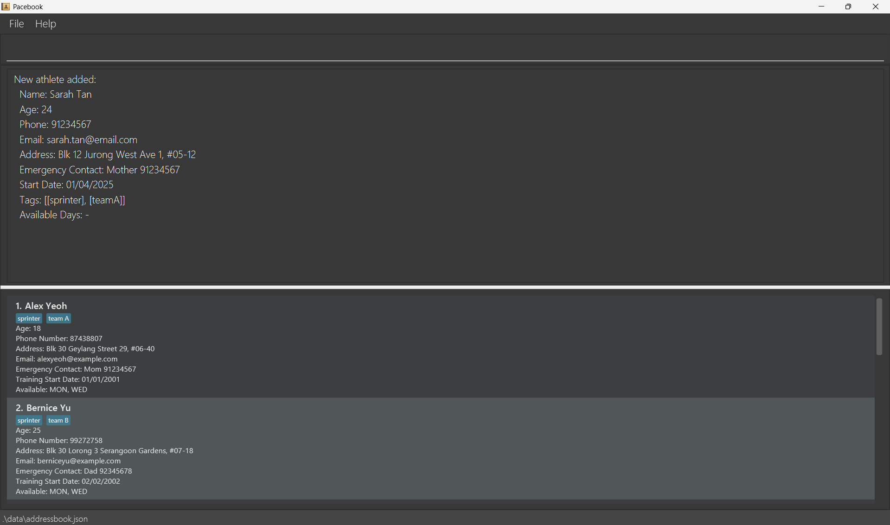
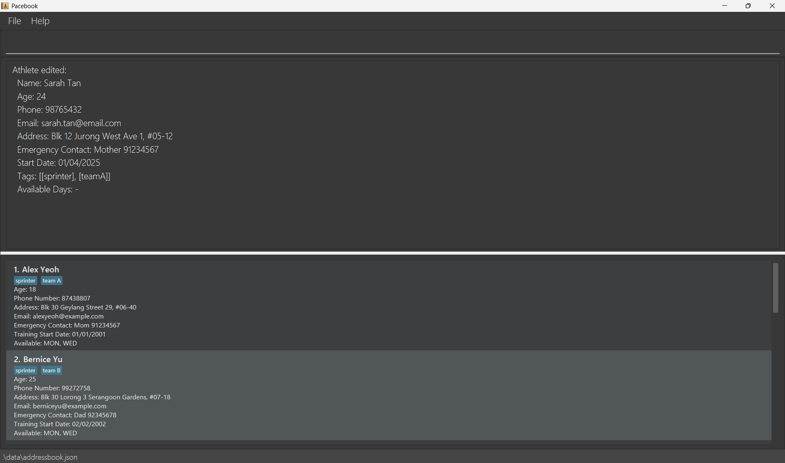
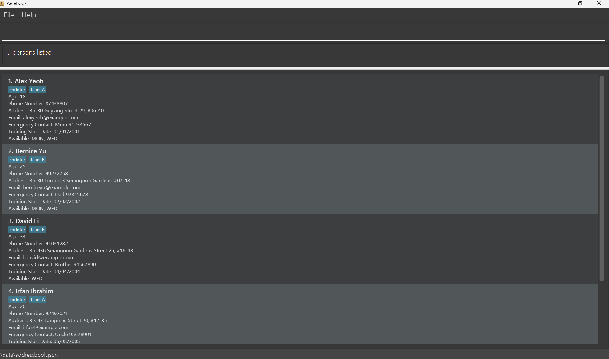
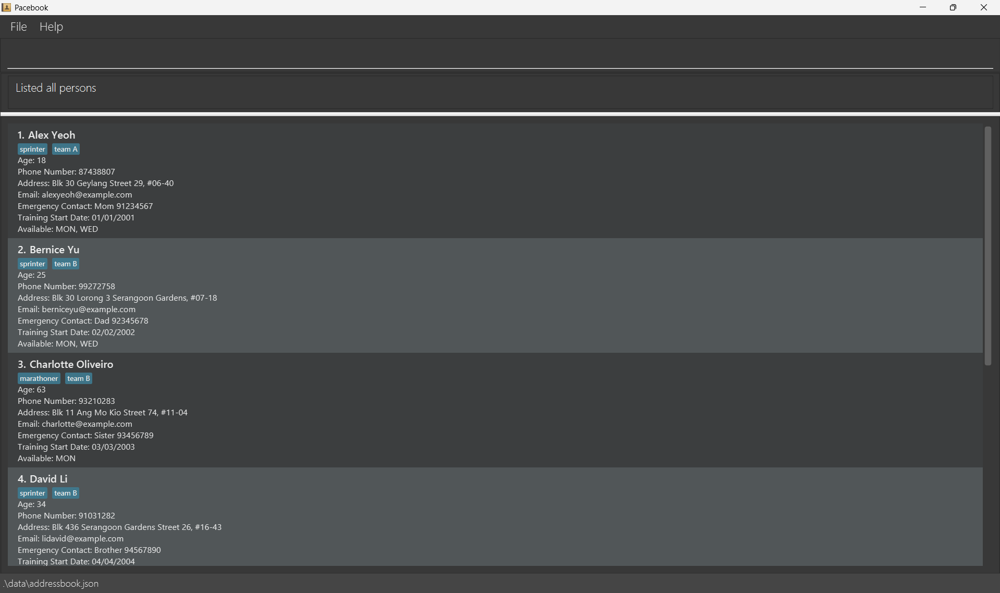
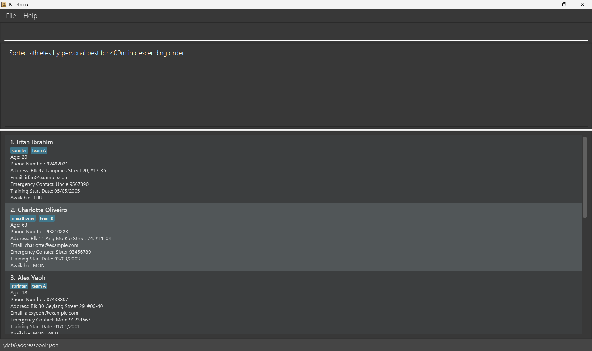
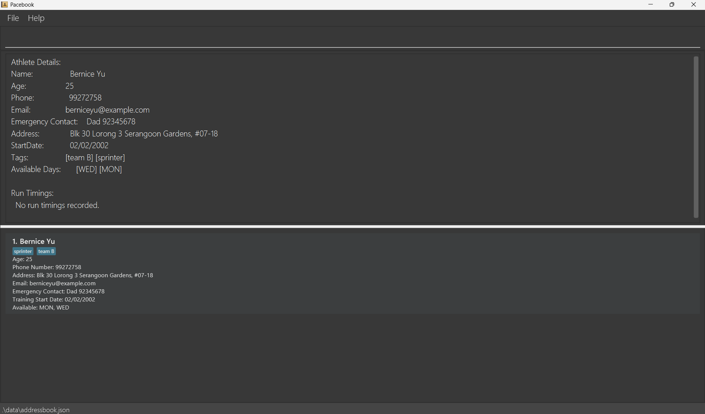
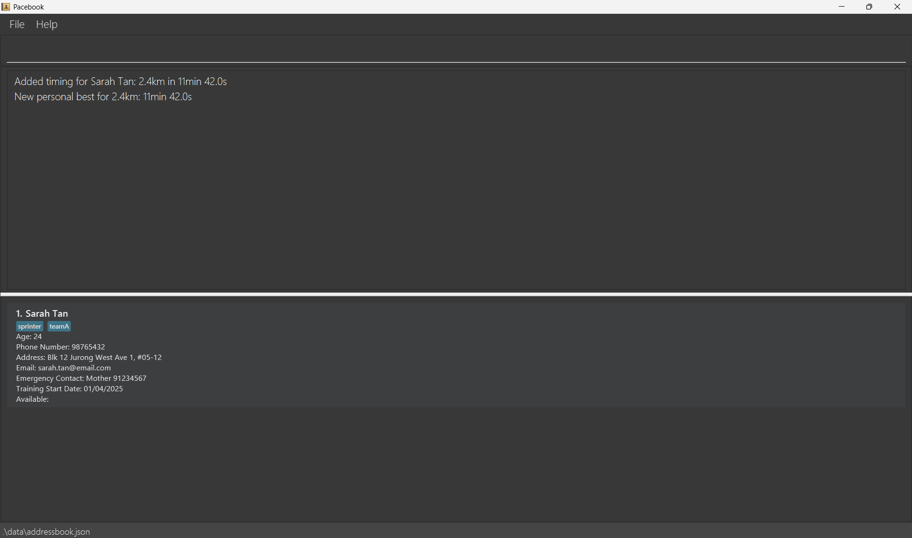
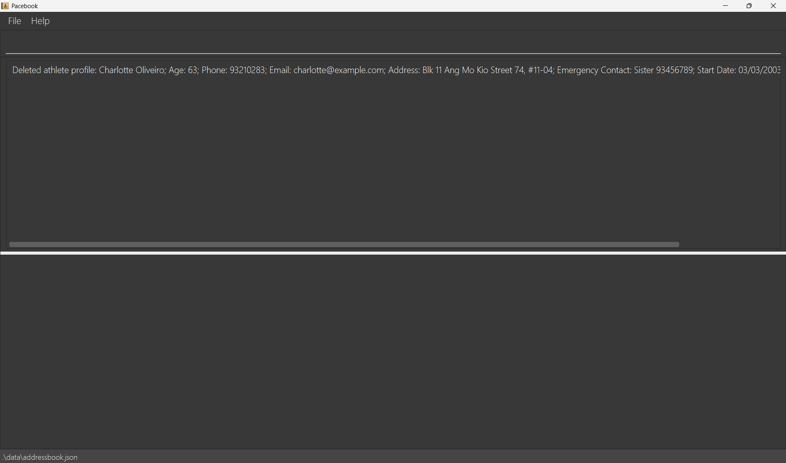
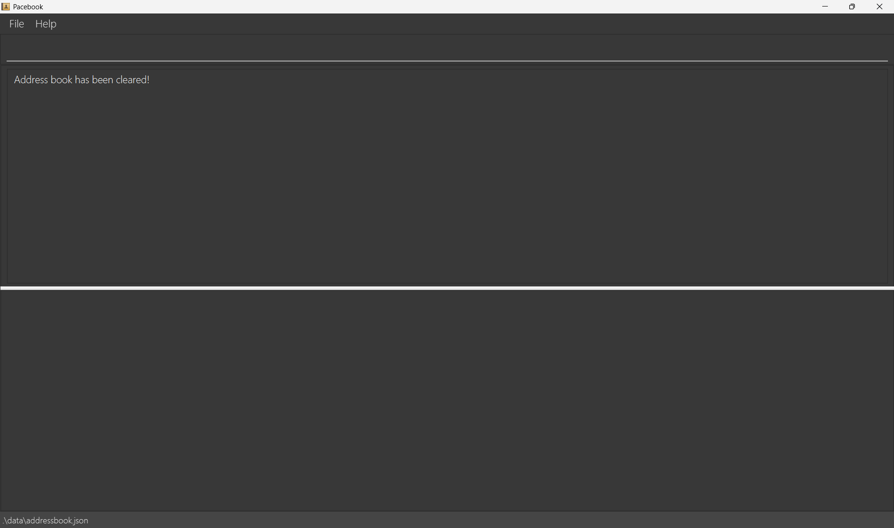
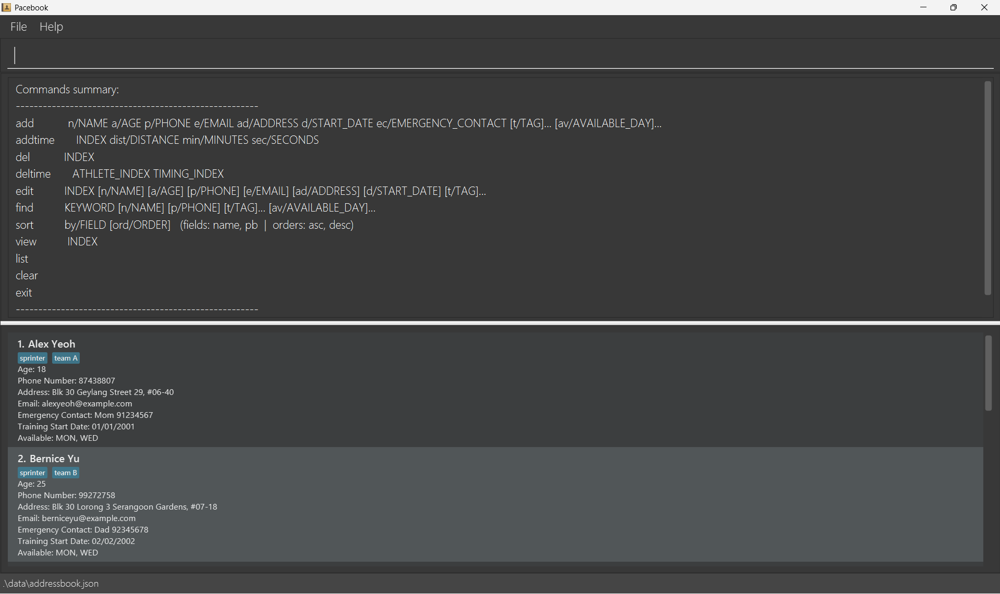

## Pacebook

At its core, Pacebook helps running coaches like you to **manage your runners’ contacts effectively**. But it's also much
more than that. It helps you keep track of runners’ data, such as their timings, training sessions, and emergency
contacts. It also allows you to find your athletes easily and monitor their improvements over time.
So, whether you manage a competitive squad or a casual running group, **let Pacebook match your pace**.

### What is Pacebook?
Pacebook is a **desktop application designed for running coaches to manage runners, run timings,
and essential contact information efficiently**. It is optimised for use via a **Command Line Interface (CLI)**, enabling fast interaction while still providing a simple graphical interface.

* Table of Contents
{:toc}

--------------------------------------------------------------------------------------------------------------------

## Quick start

Pacebook runs on Java, a free software platform required to run the app.
You do not need to know how to program — just install it once using the links provided below

1. Ensure that Java `17` or above is installed on your computer.

   Open a terminal and run `java -version`. You should see output like:
   ```
   openjdk version "17.0.12" 2024-07-16
   ```
   If Java is not installed, follow the guide for your OS:
   - **Windows:** [Java installation guide for Windows](https://se-education.org/guides/tutorials/javaInstallationWindows.html)
   - **Mac:** [Java installation guide for Mac](https://se-education.org/guides/tutorials/javaInstallationMac.html)
   - **Linux:** [Java installation guide for Linux](https://se-education.org/guides/tutorials/javaInstallationLinux.html)

2. Download the latest `.jar` file from [here](https://github.com/AY2526S2-CS2103T-W14-4/tp/releases).

3. Copy the file to the folder you want to use as the _home folder_ for Pacebook.

4. Open a command terminal and run the application by entering the following commands:
   ```
   cd [home folder]
   java -jar pacebook.jar
   ```
5. After a few seconds, the application window should appear, as shown below. The app includes sample data to help you get started.<br>
   

6. Type a command into the command box and press Enter to run it. For example, typing **`help`** and pressing Enter will open the help window.<br>
   Some example commands you can try:

* `add n/John Doe a/21 p/98765432 e/johnd@example.com ad/John street, block 123, #01-01 d/01/01/2001 ec/Father 91234567` : Adds an athlete named `John Doe` to Pacebook.

* `find n/Alex`: Finds an athlete named Alex.

* `exit` : Exits the app.
  See the [Features](#features) section below for the full list of commands and how to use them.

-------------------------------------------------------------------------------------------------------------------

## Target Users

Pacebook is designed for **running coaches aged 20–35** in Singapore who:
- Oversee a roster of **multiple runners** across training groups or teams.
- Plan and track group **training sessions and fitness benchmarks**.
- Need **fast access** to athlete data during and between sessions.

---

## Assumptions About Users

Pacebook is tailored towards running club coaches who are:

### Technical Assumptions
- Comfortable with desktop applications and file management.
- Have used a **command line or terminal** before (e.g. navigating folders,
  running scripts) — **no programming knowledge required**.
- Comfortable with spreadsheet or administrative tools
  (e.g. Microsoft Excel, Google Sheets) — **command prefixes** like n/
  and p/ will feel similar to column headers.

### Domain Assumptions
- Familiar with common running formats and distances.
  (e.g. 2.4km fitness tests, 10km runs, marathons, interval sessions).
- Understand basic performance tracking concepts such as **personal best timings**.

### Usage Assumptions
- Prefer **speed and keyboard-driven workflows** over point-and-click interfaces.
- Manage athlete data regularly.
- Work primarily in a **group club setting**, managing multiple athletes simultaneously.

---

## User Needs Addressed

Pacebook is built around the day-to-day needs of coaches who work fast and
manage athlete data regularly:

- **Maintaining an up-to-date athlete roster** — adding, editing, and removing athletes
  across training groups or the full club roster.
- **Logging and tracking run timings** — recording timing results after fitness
  tests and monitoring each athlete's personal best over time
- **Finding athletes quickly** — searching by name, tag, phone number, or
  availability without scrolling through the full list
- **Organising athletes for session planning** — sorting by name or personal
  best to prioritize training groups or identify athletes needing attention
- **Keeping emergency contact details on hand** — storing and accessing
  contact information quickly when needed during sessions
- **Making fast corrections** — updating athlete details or removing incorrect
  timing entries without disrupting the rest of the dataset

These needs are built around the pace and demands of a real club coaching workflow

--------------------------------------------------------------------------------------------------------------------

## Features

<div markdown="block" class="alert alert-info">

**:information_source: Notes about the command format:**<br>

* Words in `UPPER_CASE` are values you need to provide.
  For example, in `add n/NAME`, `NAME` should be replaced with the athlete’s actual name, such as `add n/John Doe`.

* Items in square brackets are optional.
  For example, `n/NAME [t/TAG]` can be used as `n/John Doe t/sprinter` or just `n/John Doe`.

* Items followed by `…` can be used multiple times, including zero times.
  For example, `[t/TAG]…` can be omitted completely, or used as `t/teamA`, `t/teamA t/relay`, and so on.

* Parameters can be entered in any order unless otherwise stated.
  For example, if the command format is `n/NAME p/PHONE_NUMBER`, then `p/PHONE_NUMBER n/NAME` also works.

* Extra words added to commands that do not take parameters, such as `help`, `list`, `exit`, and `clear`, will be ignored.
  For example, `help 123` will still be read as `help`.

* If you are using a PDF version of this guide, be careful when copying commands that span multiple lines, since some spaces around line breaks may be lost when pasting.
</div>

### Adding an athlete : `add`

Adds a new athlete to Pacebook.

Format: `add n/NAME a/AGE p/PHONE e/EMAIL ad/ADDRESS d/START_DATE ec/EMERGENCY_CONTACT [t/TAG]… [av/AVAILABLE_DAY]…​`

Example:
* A new sprinter joins your team A after the open trial session:
  * `add n/Sarah Tan a/24 p/91234567 e/sarah.tan@email.com ad/Blk 12 Jurong West Ave 1, #05-12 d/01/04/2025 ec/Mother 91234567 t/sprinter t/teamA`
    

<div markdown="block" class="alert alert-primary">:bulb: **Tips:**

- All compulsory fields (i.e. not in square brackets) must be provided.
- `AGE` must be a number between 10-99.
- `PHONE` must be a valid Singapore phone number (i.e. 8 digits, starts with 8 or 9).
- `EMAIL` must be a valid email, i.e. email@domain.
- `EMERGENCY_CONTACT` must follow the format `Relationship Phone`, where `Phone` is a valid Singapore phone number.
- Avoid using vague names such as `John` if you coach multiple athletes with similar names.
</div>

<div markdown="block" class="alert alert-warning">:exclamation: **Caution:**
Duplicate athletes may be rejected if an athlete with the **same phone number** already exists in Pacebook.
</div>

<div markdown="block" class="alert alert-success">✅ **Expected output:**

- A success message confirming that the athlete has been added.
- The athlete appears in the athlete list.
</div>
---

### Editing an athlete : `edit`

Updates an existing athlete's details.

Format: `edit INDEX [n/NAME] [a/AGE] [p/PHONE] [e/EMAIL] [ad/ADDRESS] [d/START_DATE] [ec/EMERGENCY_CONTACT] [ta/TAG_TO_ADD] [td/TAG_TO_DELETE]… [av/AVAILABLE_DAY]…​`
Edits the athlete at the specified `INDEX`.

Example:
* Sarah updates her contact number before the new training block:
  * `find n/Sarah Tan`
  * `edit 1 p/98765432`
  

* After promoting a runner to your competitive team mid-season:
  * `find n/Marcus Lim`
  * `edit 1 ta/teamA ta/competitive`
* After a runner steps down as team captain
  * `find n/Johnny Bravo`
  * `edit 1 td/captain`

<div markdown="block" class="alert alert-primary">:bulb: **Tips:**

* The index refers to the index number shown in the displayed athlete list.
* The index **must be a positive number**: `1, 2, 3, …`
* You must provide at least one field to edit.
* Any field you include will replace the athlete’s current value for that field.
* If you edit tags, the old tags will be replaced completely.
</div>

<div markdown="block" class="alert alert-warning">:exclamation: **Caution:**

* Make sure you are editing the correct athlete index in displayed list, especially after using `find`.
* Editing tags replaces all existing tags, not just one of them.
</div>

<div markdown="block" class="alert alert-success">✅**Expected output:**

* A success message showing the updated athlete details.
</div>

---

### Finding athletes by specified field(s): `find`

Finds all persons whose
- names contain any of the specified name keywords
- tags contain any of the specified tag keywords
- phone numbers contain any of the specified phone numbers
- availabilities contain any of the specified days

Format: `find [n/KEYWORD] [p/PHONE_NUMBER] [t/TAG]… [av/AVAILABLE_DAY]…`

Examples:
* You need to contact all sprinters before Saturday's time trial:
  * `find t/sprinter`
  
* You are filling a relay slot and need a teamA runner available on Tuesdays:
  * `find t/teamA av/Tue`
* A parent calls in and you only remember the runner's first name:
  * `find n/Sarah`

<div markdown="block" class="alert alert-primary">:bulb: **Tips:**

* The search is case-insensitive. e.g. `n/hans` will match `n/Hans`
* You must provide at least one field to search.
* The order of the search criteria does not matter. e.g. `n/Jessy t/captain` will match `t/captain n/Jessy`
* Name and phone searches use partial matching. e.g. `Han` will match `Hans`, `find p/92` will match any phone number containing `92`.
* Athletes must satisfy all the criteria.
  e.g. `n/Alex t/Marathoner` will return only the athlete with the names Alex and tag Marathoner
* Use `list` to clear the search filter and display all the athletes in Pacebook.
</div>

<div markdown="block" class="alert alert-warning">:exclamation: **Caution:**

* `find` does not support searching by age, email, emergency contact, address, start date or timing record
* If no athletes match, the list will be empty.
</div>

<div markdown="block" class="alert alert-success">✅ **Expected output:**

Only athletes matching the given keywords are shown.
</div>

---

### Listing all athletes : `list`

Lists all athletes currently stored in Pacebook.

Format: `list`

Example:
* Pulling up the full roster to confirm who is registered as a trainee under you:
  * `list`
  

<div markdown="block" class="alert alert-success">✅ **Expected output:**

All athletes currently stored in Pacebook are displayed.
</div>

<div markdown="block" class="alert alert-primary">:bulb: **Tips:**

Use `list` before commands like `view`, `edit`, and `del` if you want to confirm the current athlete indices.
</div>

---

### Sorting athletes : `sort`

Sorts the displayed athlete list by the specified field.

Format: `sort by/FIELD [dist/DISTANCE] [ord/ORDER]`

Examples:
* Identify who needs the most improvement before the next fitness test:
  * `sort by/pb dist/400m ord/desc`
    
* Before selecting runners for the inter-club competition, rank the
  team by their fastest 2.4km timing:
  * `sort by/pb dist/2.4km`
* At the start of a new season for team A, get an alphabetical overview of the
  full roster for attendance-taking:
  * `find t/teamA`
  * `sort by/name`

<div markdown="block" class="alert alert-primary">:bulb: **Tips:**

* Supported fields:
  * `name`
  * `pb` (personal best for the specified event)
* `dist/DISTANCE` is required when sorting by `pb`.
* Supported distances for `pb`:
  * `400m`
  * `2.4km`
  * `10km`
  * `42km`
* Supported orders:
  * `asc` (ascending)
  * `desc` (descending)
* If `ord/ORDER` is omitted, the default sort order is ascending.
* Sorting is applied to the currently displayed athlete list.
* For `pb`, athletes with no recorded timing for the specified event will appear after athletes with a recorded timing.
</div>

<div markdown="block" class="alert alert-warning">:exclamation: **Caution:**

* `sort` only changes the display order of athletes. It does not modify any athlete data.
* `pb` refers only to the athlete’s personal best for the requested event.
* If no athletes are currently displayed, the command will have no visible effect.
</div>

<div markdown="block" class="alert alert-success">✅ **Expected output:**

* A success message confirming the field and order used for sorting.
* The displayed athlete list is reordered accordingly.
</div>

---

### Viewing an athlete profile and training records : `view`

Displays an athlete’s profile and their training records.

Format: `view INDEX`
* Displays the athlete at the specified `INDEX`.

Example:
* Before setting Bernice's target pace for the upcoming 10km race,
  review his full timing history:
  * `find n/Bernice Yu`
  * `view 1`
  

<div markdown="block" class="alert alert-primary">:bulb: **Tips:**

* The INDEX refers to the index number shown in the displayed athlete list.
* The INDEX must be a positive number: `1, 2, 3, …`
* Use `view` after `find` to quickly inspect one athlete without scrolling through the full list.
</div>

<div markdown="block" class="alert alert-success">✅ **Expected output:**

* The selected athlete’s profile is shown.
* Any stored run timings for that athlete are shown below the profile details.
</div>

---

### Adding a timing record : `addtime`

Adds a timing record to an athlete.

Format: `addtime INDEX dist/DISTANCE min/MINUTES sec/SECONDS`
* Adds a timing record to the athlete at the specified `INDEX`.

Examples:
* After today's 2.4km fitness test, log Sarah's result:
  * `find n/Sarah Tan`
  * `addtime 1 dist/2.4km min/11 sec/42`
  

<div markdown="block" class="alert alert-primary">:bulb: **Tips:**

* Supported run distances:
  * 400m
  * 2.4km
  * 10km
  * 42km
* The index refers to the index number shown in the displayed athlete list.
* `INDEX` must be a positive number: `1, 2, 3, …`
* `MINUTES` must be a non-negative number.
* `SECONDS` must be between `0` and `59.99`.
* The total timing must be greater than `0`.
</div>

<div markdown="block" class="alert alert-warning">:exclamation: **Caution:**

* If you enter `min/0 sec/0`, the command will be rejected.
* If the same athlete has multiple timing records, make sure you add the new record to the correct athlete profile.
</div>

<div markdown="block" class="alert alert-success">✅ **Expected output:**

* A success message confirming that the timing was added.
* If the new timing is the athlete’s fastest recorded timing for that distance, a **new personal best** message is also shown.
</div>

---

### Deleting an athlete : `del`

Deletes an athlete from Pacebook.

Format: `del INDEX`
* Deletes the athlete at the specified `INDEX`.

Example:
* A runner has moved overseas and officially left the club:
  * `find n/Charlotte Oliveiro`
  * `del 1`
  

<div markdown="block" class="alert alert-primary">:bulb: **Tips:**

* The index refers to the index number shown in the displayed athlete list.
* The index **must be a positive number**: `1, 2, 3, …`
</div>

<div markdown="block" class="alert alert-danger">⚠️ **Warning:**

This action removes the athlete and their associated training data from the app.
Please double-check the athlete index in the display list before deleting.
</div>

<div markdown="block" class="alert alert-success">✅ **Expected output:**

A success message confirming which athlete was deleted.
</div>

---

### Deleting a timing record : `deltime`

Deletes a timing record from an athlete’s profile.

Format: `deltime ATHLETE_INDEX RECORD_INDEX`
* Deletes the timing record at `RECORD_INDEX` for the athlete at `ATHLETE_INDEX`.

Example:
* You accidentally logged Marcus's timing under Sarah's profile
  during the fitness test:
  * `find n/Sarah Tan`
  * `view 1`
  * `deltime 1 1`
  

<div markdown="block" class="alert alert-primary">:bulb: **Tips:**

* `ATHLETE_INDEX` refers to the index number shown in the displayed athlete list.
* `RECORD_INDEX` refers to the index number shown in the displayed training records.
* Both `ATHLETE_INDEX` and `RECORD_INDEX` must be positive integers: `1, 2, 3, …`
</div>

<div markdown="block" class="alert alert-warning">:exclamation: **Caution:**

* Make sure you check the athlete profile with `view` first so that you delete the correct timing record.
* Deleting a timing record may affect the athlete’s visible performance history.
</div>

<div markdown="block" class="alert alert-success">✅ **Expected output:**

A success message confirming that the selected timing record was deleted.
</div>

---

### Clearing all entries : `clear`

Clears all athletes from Pacebook.

Format: `clear`

Example:
* At the start of a new season, you are onboarding a completely
  new squad and need to wipe the previous cohort's data:
  * `clear`
  

<div markdown="block" class="alert alert-danger">⚠️ **Warning:**

* This removes all athletes currently stored in the app.
* Use this only if you are sure you want to wipe the current dataset.
</div>

<div markdown="block" class="alert alert-primary">:bulb: **Tips:**

* Avoid using `clear` if you only want to remove one athlete. Use `del` instead.
</div>

<div markdown="block" class="alert alert-success">✅ **Expected output:**

* All athletes are removed from the list.
</div>

---

### Viewing help : `help`

Opens the help window.

Format: `help`


<div markdown="block" class="alert alert-primary">:bulb: **Tips:**

Use `help` whenever you forget a command format instead of guessing the prefixes.
</div>

<div markdown="block" class="alert alert-success">✅ **Expected output:**

A help window opens with a summary of available commands.
</div>
---


### Exiting the program : `exit`

Exits the program.

Format: `exit`

<div markdown="block" class="alert alert-success">✅ **Expected output:**

The application closes.
</div>

<div markdown="block" class="alert alert-primary">:bulb: **Tips:**

* There is no need to save manually before exiting because Pacebook saves automatically after successful changes.
</div>
---


### Saving the data

Pacebook saves your data automatically whenever a command changes it, so you do not need to save manually.
* No separate save confirmation may be shown, but your data will be written to the data file after successful commands.

<div markdown="block" class="alert alert-primary">:bulb: **Tips:**

* Close the application normally using `exit` to reduce the risk of interrupting the file saving process.
</div>
---

### Editing the data file

Pacebook stores its data as a JSON file at `[JAR file location]/data/addressbook.json`. Advanced users can edit this file directly if needed.

<div markdown="block" class="alert alert-warning">:exclamation: **Caution:**

If your changes corrupt the data file, Pacebook may discard unreadable data or fail to load it correctly the next time it runs. It is strongly recommended to **back up the file** before editing it manually.<br>
Furthermore, certain edits can cause Pacebook to behave in unexpected ways if values are outside the accepted format. Edit the data file only if you are confident that you can update it correctly.
</div>

<div markdown="block" class="alert alert-primary">:bulb: **Tips:**

* Manual file editing is meant for advanced users only. Most users should use the app commands instead.
</div>
--------------------------------------------------------------------------------------------------------------------

## FAQ

**Q**: How do I transfer my data to another Computer?<br>
**A**: Install the app in the other computer and overwrite the empty data file it creates with the file that contains the data of your previous Pacebook home folder.

--------------------------------------------------------------------------------------------------------------------

## Known issues

1. **When using multiple screens**, if you move the application to a secondary screen, and later switch to using only the primary screen, the application window will open off-screen. The solution is to delete the `preferences.json` file created by the application before running the application again.
2. **If you minimize the Help Window** and then run the `help` command (or use the `Help` menu, or the keyboard shortcut `F1`) again, the original Help Window will remain minimized, and no new Help Window will appear. The remedy is to manually restore the minimized Help Window.

--------------------------------------------------------------------------------------------------------------------

## Command summary

| Action             | Format, Examples                                                                                                                                                                                                                |
|--------------------|---------------------------------------------------------------------------------------------------------------------------------------------------------------------------------------------------------------------------------|
| **Add Athlete**    | `add n/NAME a/AGE p/PHONE e/EMAIL ad/ADDRESS d/START_DATE ec/EMERGENCY_CONTACT [t/TAG]… [av/AVAILABLE_DAY]…​` <br> e.g., `add n/Sarah Tan a/24 p/91234567 e/sarah.tan@email.com ad/Blk 12 Jurong West Ave 1, #05-12 d/01/04/2025 ec/Mother 91234567 t/sprinter t/teamA` |
| **Edit**           | `edit INDEX [n/NAME] [a/AGE] [p/PHONE] [e/EMAIL] [ad/ADDRESS] [d/START_DATE] [ec/EMERGENCY_CONTACT] [ta/TAG_TO_ADD]… [td/TAG_TO_DELETE]… [av/AVAILABLE_DAY]…​`<br> e.g., `edit 1 ec/Father 92345678`                                                   |
| **Find**           | `find [n/NAME] [p/PHONE] [t/TAG] [av/AVAILABLE_DAY]`<br> e.g., `find n/Sarah t/sprinter`                                                                                                                                        |
| **List**           | `list`                                                                                                                                                                                                                          |
| **Sort**           | `sort by/FIELD [dist/DISTANCE] [ord/ORDER]` <br> e.g., `sort by/pb dist/400m ord/desc`                                                                                                                                         |
| **View Athlete**   | `view INDEX`<br> e.g., `view 3`                                                                                                                                                                                                 |
| **Add Timing**     | `addtime INDEX dist/DISTANCE min/MINUTES sec/SECONDS`<br> e.g., `addtime 2 dist/400m min/10 sec/30`                                                                                                                             |
| **Delete Athlete** | `del INDEX`<br> e.g., `del 3`                                                                                                                                                                                                   |
| **Delete Timing**  | `deltime ATHLETE_INDEX RECORD_INDEX`<br> e.g., `deltime 2 2`                                                                                                                                                                    |
| **Clear**          | `clear`                                                                                                                                                                                                                         |
| **Help**           | `help`                                                                                                                                                                                                                          |
| **Exit**           | `exit`                                                                                                                                                                                                                          |
